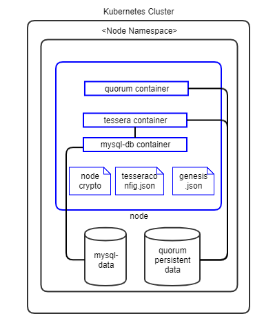
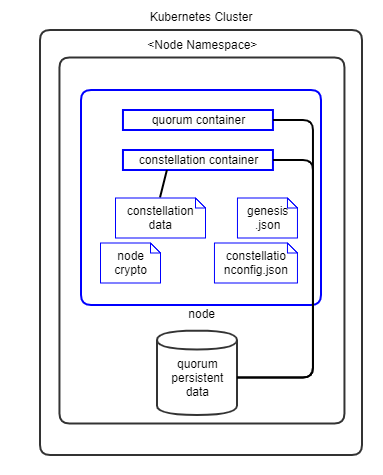

# Quorum Architecture Reference

## Kubernetes

### Nodes with Tessera

The following diagram shows how Quorum peer nodes with Tessera TM will be deployed on your Kubernetes instance.

**Notes:**

1. Pods are shown in blue in the diagram.

1. Each peer pod will have three init-containers: `certificates-init` to read crypto from Vault, `mysql-init` to initialize MySQL DB and `quorum-genesis-init-container` to generate genesis block.

1. Each peer pod will then have three containers: `mysql-db`, `tessera` and `quorum` containers running. Since they are in the same pod, Kubernetes always schedules them on the same VM and they can communicate to each other through localhost. This guarantees minimal latency between them.

1. The storage uses a Kubernetes Persistent Volume.

### Nodes with Constellation

The following diagram shows how Quorum peer nodes with Constellation TM will be deployed on your Kubernetes instance.

**Notes:**

1. Pods are shown in blue in the diagram.

1. Each peer pod will have two init-containers: `certificates-init` to read crypto from Vault and `quorum-genesis-init-container` to generate genesis block.

1. Each peer pod will then have two containers: `constellation` and `quorum` containers running. Since they are in the same pod, Kubernetes always schedules them on the same VM and they can communicate to each other through localhost. This guarantees minimal latency between them.

1. The storage uses a Kubernetes Persistent Volume.

## Components

### Docker Images
The Blockchain Automation Framework uses the officially published Quorum Docker images from [hub.docker.com](https://hub.docker.com/u/quorumengineering). The following Quorum Images are used by the Blockchain Automation Framework.

*  [quorum](https://hub.docker.com/r/quorumengineering/quorum) - Quorum Peer Node

*  [tessera](https://hub.docker.com/r/quorumengineering/tessera) - Tessera Transaction Manager

*  [constellation](https://hub.docker.com/r/quorumengineering/constellation) - Constellation Transaction Manager

Additionnally, following common images are also used:

*  [busybox](https://hub.docker.com/_/busybox) - Used for DB initialtization

*  [mysql-server](https://hub.docker.com/r/mysql/mysql-server) - Used as the DB for Tessera Transaction Manager

*  [alpine-utils](https://hub.docker.com/r/hyperledgerlabs/alpine-utils) - Used as a utility to get crypto from Hashicorp Vault server

### Ansible Playbooks
Detailed information on ansible playbooks can be referred [here](../developer/quorum-ansible.md) and the execution process can be referred [here](../operations/setting_dlt.md).

### Helm Charts
Detailed information on helm charts can be referred [here](../developer/quorum-helmcharts.md).

## Vault Configuration

The Blockchain Automation Framework stores their `crypto` immediately in the Hashicorp Vault secrets engine.
The crypto is stored by each organization under path `secret/org_namespace` - it contains node keys, keystore, passwords, TM keys, and CA certificates for proxy connections.

The complete key paths in the Vault can be referred [here](certificates_path_list_quorum.md).